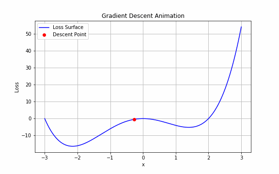

## 🎥 Gradient Descent Visualization

This animation shows how gradient descent iteratively updates parameters to reach the minimum of a loss function.

This project demonstrates how gradient descent iteratively updates model parameters to minimize a loss function. The animation visualizes the optimization process on a polynomial loss surface, showing how the algorithm converges toward the global minimum — a foundational concept in training neural networks and deep learning models.
